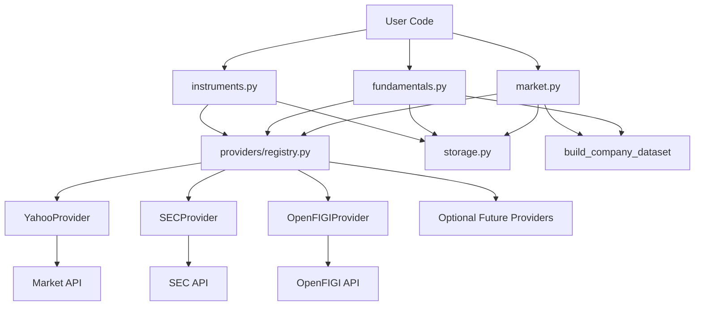
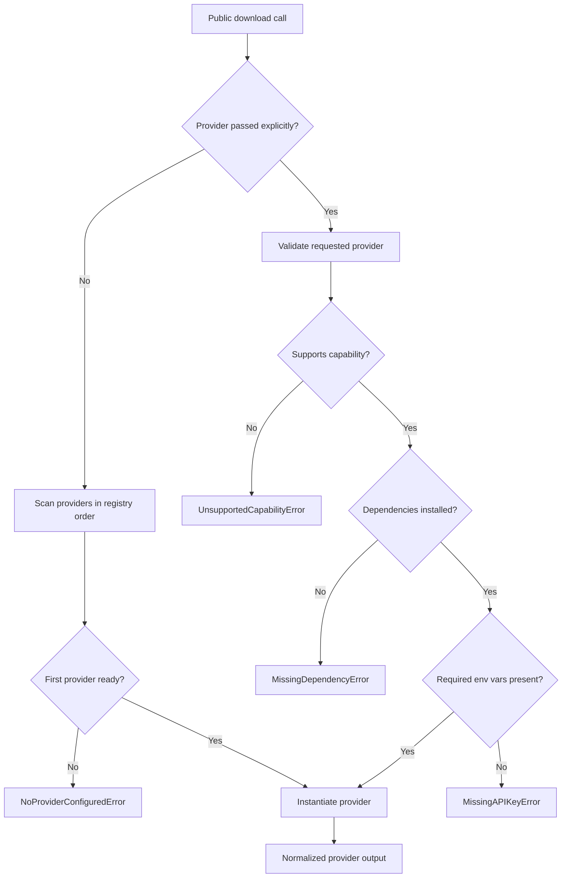
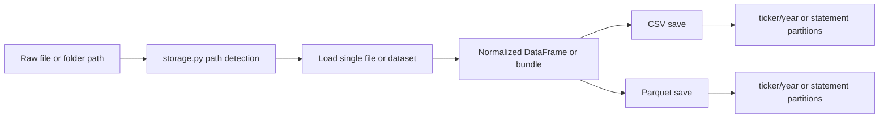
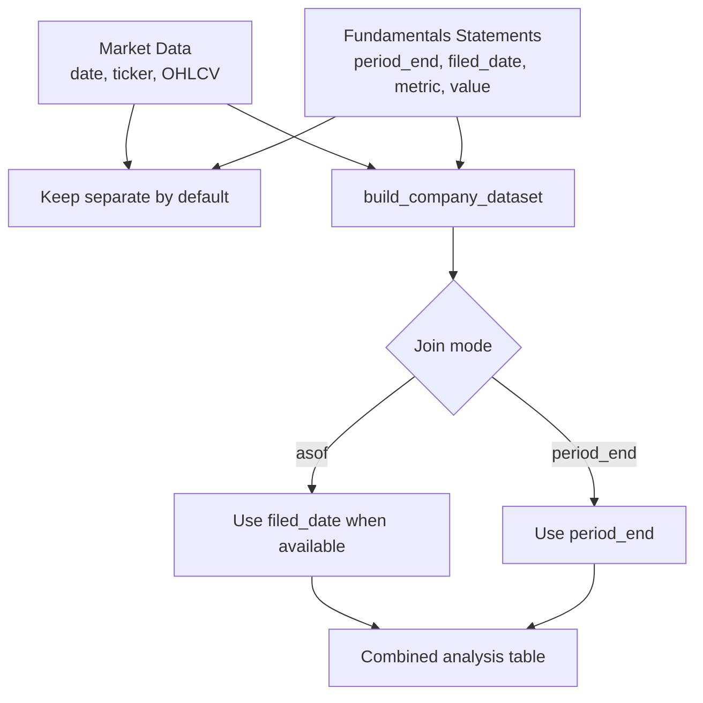

# Fintern Data Layer

This note is the current map of `fintern.data`.

The goal of the data layer is:

- keep the user-facing API simple
- keep market data, fundamentals, and instrument resolution clearly separated
- allow optional providers without forcing every dependency on every user
- make save/load round-trips work for both single files and partitioned datasets
- keep the architecture easy to extend later

## Public API

The main user-facing entry points are exported from `fintern.data`:

- `download_market_data(...)`
- `load_market_data(...)`
- `download_fundamentals(...)`
- `load_fundamentals(...)`
- `resolve_instruments(...)`
- `load_instruments(...)`
- `build_company_dataset(...)`

Recommended mental model:

- market data = price time series by trading timestamp/date
- fundamentals = statement facts by reporting period / filed date
- instruments = identifier mapping layer

By default, market and fundamentals stay separate.  
`build_company_dataset(...)` exists for the advanced case where we explicitly want to align both.

## Architecture Overview

## Folder Structure

`src/fintern/data/`

- `market.py`
  Public orchestration for market downloads and market load/save.
- `fundamentals.py`
  Public orchestration for fundamentals downloads, load/save, and the market+fundamentals join helper.
- `instruments.py`
  Public orchestration for symbol/identifier resolution.
- `storage.py`
  Shared file and folder detection plus generic tabular load/save helpers.
- `models.py`
  Small shared typing/dataclass models used across the provider layer.
- `exceptions.py`
  Custom data-layer errors with user-friendly messages.
- `providers/`
  One file per provider, plus shared provider abstractions and registry logic.

## How a Download Works

### Market

`download_market_data(...)` in `market.py`:

1. normalizes ticker input
2. asks the provider registry for a provider that supports `market`
3. provider returns a normalized OHLCV `DataFrame`
4. optional save step writes CSV or parquet, flat or partitioned

### Fundamentals

`download_fundamentals(...)` in `fundamentals.py`:

1. normalizes ticker input
2. asks the provider registry for a provider that supports `fundamentals`
3. provider returns a normalized bundle:
   - `statements`
   - `company_profile`
4. optional save step writes a folder-based dataset

### Instruments

`resolve_instruments(...)` in `instruments.py`:

1. normalizes symbols
2. asks the provider registry for a provider that supports `instruments`
3. provider returns a normalized instrument table
4. optional save step writes a flat CSV/parquet table

## Provider Selection

Provider selection lives in `providers/registry.py`.

It works like this:

- if the user passes `provider="yahoo"` or another explicit name:
  the registry validates that exact provider
- if no provider is passed:
  the registry picks the first available provider that supports the requested capability

Availability is based on three things:

1. does the provider support this capability?
2. are the optional Python dependencies installed?
3. are the required environment variables present?

If a provider cannot be used, the registry raises clear custom errors from `exceptions.py`, for example:

- `MissingDependencyError`
- `MissingAPIKeyError`
- `NoProviderConfiguredError`
- `UnsupportedCapabilityError`

This keeps optional dependencies truly optional.

## Current Providers

### Implemented in v1

- `YahooProvider`
  Market prices only.
- `SECProvider`
  Fundamentals only.
- `OpenFIGIProvider`
  Instrument resolution only.

### Scaffolded for later

- `FMPProvider`
- `EODHDProvider`
- `AlphaVantageProvider`

These adapters already participate in availability checks, but they are intentionally not feature-complete yet.

## Provider Responsibilities

Each provider file should stay thin and focused.

Provider responsibilities:

- own optional imports
- own API-specific request logic
- own normalization into fintern's internal shape
- truthfully report capability support and availability

The public orchestration files should not import provider SDKs directly.

## Normalized Shapes

### Market data

Expected normalized columns are roughly:

- `date`
- `ticker`
- `open`
- `high`
- `low`
- `close`
- `adj_close`
- `volume`

Provider-specific extras can still be present, but these core columns should be stable.

### Fundamentals

Fundamentals currently return a bundle:

- `statements`: long analysis-friendly table
- `company_profile`: company metadata table

Important `statements` columns include:

- `ticker`
- `statement`
- `metric`
- `value`
- `period_start`
- `period_end`
- `filed_date`
- `fiscal_year`
- `fiscal_period`
- `provider`

This is intentionally a long table, not raw provider JSON and not a naive wide merge.

### Instruments

Instrument resolution aims to normalize identifiers such as:

- `symbol`
- `ticker`
- `exchange`
- `currency`
- `figi`
- `cik`
- provider metadata

Not every provider will populate every identifier.

## Save / Load Behavior

Shared storage logic lives in `storage.py`.

It supports:

- single files
- nested folders
- partitioned parquet datasets
- partitioned CSV datasets
- several common tabular formats

### Market datasets

Market saves default to partition-friendly layouts by:

- `ticker`
- `year`

This keeps big price datasets scalable.

### Fundamentals datasets

Fundamentals save to a folder root containing:

- `statements/`
- `company_profile.csv` or `company_profile.parquet`

`statements/` is partitioned by the best available keys, typically:

- `ticker`
- `statement`
- `fiscal_year`

### Instruments datasets

Instrument mappings are saved as a flat table because they are usually small and lookup-oriented.

## Joining Market and Fundamentals

`build_company_dataset(...)` is the only intended path for combining both layers.

Supported modes:

- `join="asof"`
  uses filing chronology when available, so only already-filed fundamentals are joined onto market rows
- `join="period_end"`
  aligns on report period end instead

This is better than raw `concat`, because market data and fundamentals do not share the same natural grain.

## Testing Strategy

Tests are designed so normal test runs do not depend on live APIs.

### Default tests

- use committed fixtures
- mock provider calls where appropriate
- verify normalization and orchestration behavior
- verify clear error messages for missing deps / missing config

### Live tests

Live tests exist but are opt-in only.

They are skipped unless explicitly enabled with environment variables, for example:

- `FINTERN_RUN_LIVE_API_TESTS=1`
- provider-specific API settings when needed

### Fixture refresh

A small manual helper exists at:

- `tests/fixtures/data/providers/refresh_fixtures.py`

It is only for manual fixture refreshes and should not be part of the normal test suite.

## Environment Variables

Current provider-related configuration:

- `FINTERN_OPENFIGI_API_KEY`
- `FINTERN_OPENFIGI_USER_AGENT` optional
- `FINTERN_SEC_USER_AGENT` recommended for SEC requests
- `FINTERN_FMP_API_KEY`
- `FINTERN_EODHD_API_KEY`
- `FINTERN_ALPHA_VANTAGE_API_KEY`
- `FINTERN_RUN_LIVE_API_TESTS`

## Optional Dependencies

Optional extras are declared in `pyproject.toml`.

Current extras:

- `yahoo`
- `sec`
- `openfigi`
- `fmp`
- `eodhd`
- `alpha-vantage`
- `data`

The idea is:

- install only what you need
- keep import errors isolated to the provider that needs them

## Adding a New Provider Later

The intended workflow is:

1. create a new file in `src/fintern/data/providers/`
2. subclass `ProviderBase`
3. declare:
   - `name`
   - capability flags
   - optional dependencies
   - required env vars
4. implement only the supported methods
5. normalize provider output before returning it
6. register the provider in `providers/registry.py`
7. add fixture-based tests

Good rule:

- only claim support for what actually works

## Current Design Decisions

These are intentional and should stay true unless we explicitly decide otherwise:

- market, fundamentals, and instruments are separate user-facing concepts
- `OpenFIGI` is not a price provider
- `SEC` is not a market-price provider
- `Yahoo` is not a fundamentals provider in v1
- normalized tables are preferred over provider-native nested payloads
- advanced combination happens through explicit helpers, not automatic concatenation

## If Something Feels Wrong

The first places to check are usually:

- `providers/registry.py`
  for provider selection and availability behavior
- `storage.py`
  for path detection, partition parsing, and load/save behavior
- the specific provider file
  for normalization or request issues
- `fundamentals.py`
  for join logic or bundle shape

## Short Version

If we want one sentence:

`fintern.data` is built as a thin public API on top of a provider registry, provider-specific normalization, and a shared storage layer so the library stays simple for users and scalable for future data sources.
